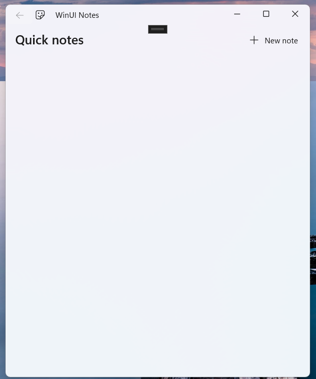
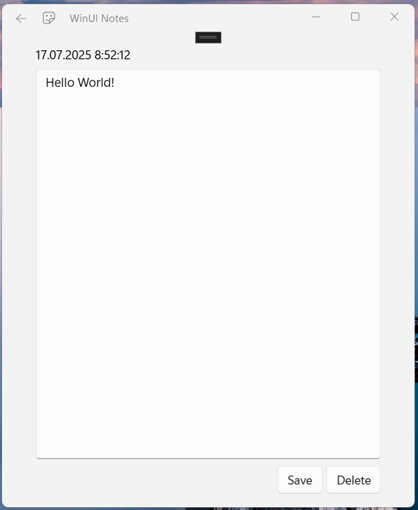
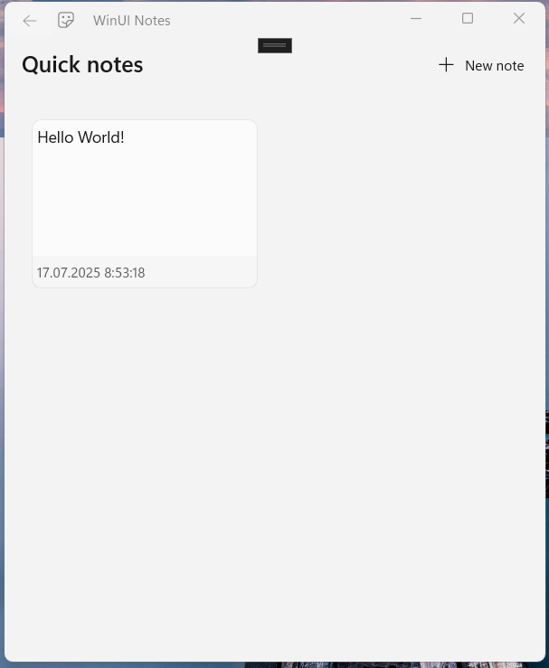

# MicrosoftNoteExample

Microsoft tutorial of [Create a WinUI app](https://learn.microsoft.com/ru-ru/windows/apps/tutorials/winui-notes/)

### In this progect, I learn how to:

* Use XAML markup to define the user interface of the app.
* Interact with XAML elements through C# code.
* Save and load files from the local file system.
* Create views and bind them to data.
* Use navigation to move to and from pages in the app.
* Use resources like documentation and sample apps to create your own app.

### My project contains: 
* NotePage - a page for editing a single note.
* AllNotesPage - a page to show all the saved notes.

## The final application is shown below:

### Main window without Notes

### Create Note page

### Main window with Notes

